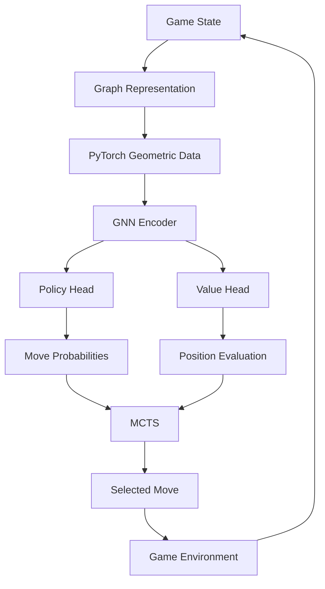
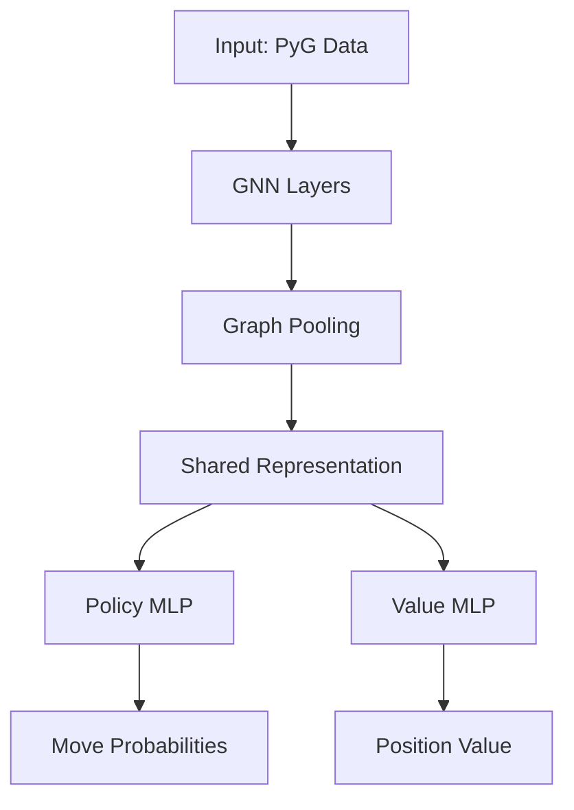
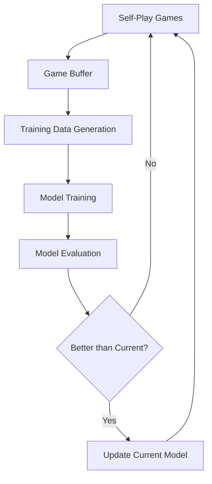
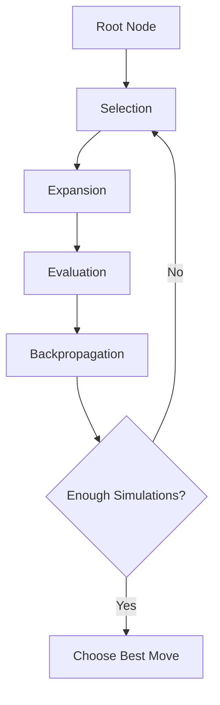

# Comprehensive Plan for Implementing Reinforcement Learning with GNNs for Hive

## 1. Overall Architecture

### Key Components:

1. **GNN Encoder**: Processes the graph representation of the game state
2. **Policy Head**: Outputs move probabilities
3. **Value Head**: Evaluates the current position
4. **Monte Carlo Tree Search (MCTS)**: Uses policy and value predictions to plan moves
5. **Training Pipeline**: Manages self-play, data collection, and model updates

## 2. Development Phases

### Phase 1: Foundation and Supervised Learning

#### 1.1 Model Architecture Design
- Design a GNN architecture that builds on your existing graph representation
- Create policy and value heads that connect to the GNN encoder
- Implement a prediction interface that returns move probabilities and position evaluation

#### 1.2 Data Generation from Rule-Based AI
- Create a data collection pipeline that records games played by your rule-based AIs
- Store game states, moves chosen, and game outcomes
- Implement data augmentation techniques (e.g., board rotations/reflections if applicable)

#### 1.3 Supervised Learning
- Train the policy network to predict moves made by the rule-based AI
- Train the value network to predict game outcomes
- Implement validation to measure prediction accuracy

### Phase 2: Reinforcement Learning Setup

#### 2.1 MCTS Implementation
- Implement Monte Carlo Tree Search that uses the neural network for guidance
- Create a configurable search process with adjustable parameters (search depth, exploration factor)
- Integrate with the game engine for move selection

#### 2.2 Self-Play Framework
- Develop a self-play system where the AI plays against itself
- Create a game buffer to store self-play games for training
- Implement parallel game generation if resources allow

#### 2.3 Initial RL Training Loop
- Create the reinforcement learning training loop
- Implement policy iteration (self-play → training → evaluation)
- Start with a small scale to validate the approach

### Phase 3: Advanced Training and Optimization

#### 3.1 Curriculum Learning
- Start with simplified game scenarios or against weaker opponents
- Gradually increase difficulty as the model improves
- Implement a rating system to track progress

#### 3.2 Optimization Techniques
- Add experience replay with prioritization
- Implement regularization techniques to prevent overfitting
- Add temperature sampling for move selection during self-play

#### 3.3 Performance Evaluation
- Create an evaluation framework to measure progress
- Compare against rule-based AIs and previous versions
- Track metrics like win rate, game length, and decision quality

### Phase 4: Scaling and Refinement

#### 4.1 Model Scaling
- Increase model size and complexity as resources allow
- Experiment with different GNN architectures
- Optimize for inference speed to allow deeper search

#### 4.2 Advanced Search Techniques
- Implement enhancements to MCTS (e.g., policy-guided playouts)
- Add opening book generation from self-play games
- Explore endgame tablebases if feasible

#### 4.3 Competitive Play
- Test against human players or other Hive AIs
- Analyze weaknesses and implement targeted improvements
- Consider specialized training for different game phases

## 3. Technical Implementation Details

### 3.1 GNN Architecture

The GNN architecture will build on your existing graph representation:

- **Node Features**: Piece type, affiliation, stack height, legal moves
- **Edge Types**: Adjacent, above, below, move, retro-move
- **Model Structure**: Multiple GNN layers followed by policy and value heads

### 3.2 Training Pipeline

### 3.3 MCTS Implementation

## 4. Transition Strategy from Rule-Based to Self-Play

### 4.1 Initial Guidance
- Start with supervised learning from rule-based AI games
- Use rule-based evaluation as a regularization term during early RL training
- Implement a hybrid evaluation that combines neural network and rule-based scores

### 4.2 Progressive Transition
- Gradually reduce the influence of rule-based evaluation
- Increase the weight of self-play generated data
- Monitor performance to ensure continuous improvement

### 4.3 Full Self-Play
- Eventually rely entirely on self-play for training data
- Keep rule-based AIs as evaluation benchmarks
- Maintain a population of models at different strengths for training diversity

## 5. Evaluation and Benchmarking

### 5.1 Metrics
- Win rate against rule-based AIs
- Self-play Elo rating system
- Decision quality metrics (agreement with optimal moves if available)
- Learning curve analysis

### 5.2 Visualization and Analysis
- Game outcome visualization
- Position evaluation accuracy
- Policy prediction accuracy
- Learning progress dashboards

## 6. Technical Considerations and Challenges

### 6.1 Graph Representation Enhancements
- Consider adding global graph features
- Experiment with different edge types and features
- Optimize the graph creation process for training speed

### 6.2 Training Efficiency
- Implement batch processing of games
- Consider distributed training for larger models
- Use mixed precision training to reduce memory requirements

### 6.3 Exploration vs. Exploitation
- Balance between exploring new strategies and exploiting known good moves
- Implement progressive widening in MCTS
- Add noise to policy predictions during self-play

### 6.4 Catastrophic Forgetting
- Implement experience replay with a diverse set of positions
- Periodically evaluate against older versions
- Consider model ensembling for more stable performance

## 7. Implementation Roadmap

### Milestone 1: Basic Infrastructure (1-2 weeks)
- Complete GNN model architecture
- Implement data collection from rule-based AI games
- Create supervised learning pipeline

### Milestone 2: Initial RL Framework (2-3 weeks)
- Implement basic MCTS with neural network guidance
- Create self-play infrastructure
- Develop initial training loop

### Milestone 3: Training and Evaluation (3-4 weeks)
- Train initial models with supervised learning
- Begin reinforcement learning training
- Implement evaluation framework

### Milestone 4: Optimization and Scaling (4+ weeks)
- Refine model architecture based on performance
- Implement advanced training techniques
- Scale up training as resources allow

### Milestone 5: Competitive Play (Ongoing)
- Evaluate against external benchmarks
- Analyze and address weaknesses
- Continuously improve through targeted training

## 8. Required New Components

1. **Neural Network Models**
   - GNN encoder
   - Policy and value heads
   - Model saving/loading utilities

2. **MCTS Implementation**
   - Tree node structure
   - Selection, expansion, simulation, backpropagation
   - UCB scoring with neural network guidance

3. **Training Infrastructure**
   - Self-play game generation
   - Experience buffer
   - Training loop with optimization

4. **Evaluation Framework**
   - Tournament system
   - Metrics tracking
   - Visualization tools

5. **Integration with Existing Code**
   - Interface with game engine
   - Compatibility with existing AI agents
   - Utilization of graph representation code